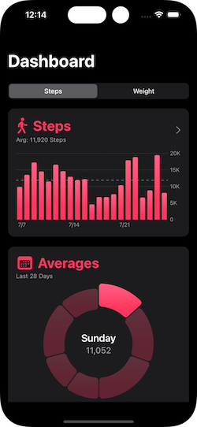

# Step Tracker (Sean Allen Portfolio Course) [Teachable.com](https://seanallen.teachable.com)
Step Tracker integrates Apple Health to display the users most up-to-date step and weight data in an interactive Swift Charts with animations. The user can also track their average step count and weight gain/loss for the pass 28 days.

Users can also upload new step and weight data directly to HealthKit through the Step Tracker App.

#Technologies Used
* SwiftUI
* HealthKit
* Swift Charts
* Swift Algorithms
* DocC
* Git & GitHub

# Animated Charts


https://github.com/user-attachments/assets/d3983a4d-b411-4919-b66d-56fb0d36576e


# Challenges
Calculating the average weight difference per day of the week for the weight Bar Chart.
I solved this challenge by pulling the last 29 days of weight data and calculated the difference between each weekday. I then took the average of each weekdays gain/loss and used the weekday averages as plot points on the weight bar chart. I used different color bars to represent gain and losses to assist users with visualizing their progress on the chart.
```swift
  static func averageDailyWeightDiffs(for weights: [HealthMetric]) -> [DateValueChartData] {
    var diffValues: [(date: Date, value: Double)] = []

    guard weights.count > 1 else { return [] }

    for i in 1..<weights.count {
      let date = weights[i].date
      let diff = weights[i].value - weights[i - 1].value
      diffValues.append((date: date, value: diff))

    }

    let sortedByWeekday = diffValues.sorted(using: KeyPathComparator(\.date.weekdayInt))
    let weekdayArray = sortedByWeekday.chunked { $0.date.weekdayInt == $1.date.weekdayInt }

    var weekdayChartData: [DateValueChartData] = []

    for array in weekdayArray {
      guard let firstValue = array.first else { continue }
      let total = array.reduce(0) { $0 + $1.value }
      let avgWeightDiff = total/Double(array.count)

      weekdayChartData.append(.init(date: firstValue.date, value: avgWeightDiff))
    }

    return weekdayChartData
  }
```
# Charts
 

# Additional Project Implementations
* Error Handling & Alerts
* Empty States
* Permission Priming
* Text Input validation
* Unit Tests
* Accessibility
* Privacy Manifest
* Code Documentation (DocC)
